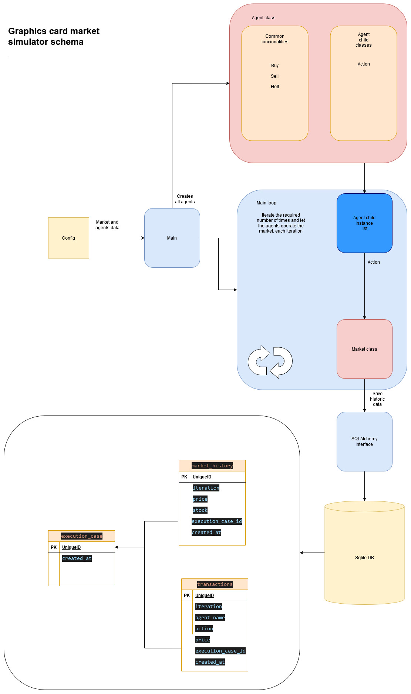

# Graphics Card Market Simulator

A simulation of a GPU market with economic agents.

## Table of Contents

- [Introduction](#introduction)
- [Requirements](#requirements)
- [Installation](#installation)
- [Running the Project](#running-the-project)
- [Testing](#testing)

## Introduction

This project offers a comprehensive simulation of a GPU market by modeling the interactions between various economic agents. Implemented in Python, the project follows SOLID principles and utilizes a class-oriented design, incorporating basic testing and best software engineering practices. The system is underpinned by an SQLite database, and the inclusion of a workflow schema, docstrings, and a pyproject.toml configuration enhances maintainability. While intended as a technical test rather than a real-world application, this repository aims to exemplify industry-standard coding principles and Python-based application development.

## Requirements

- Python >= 3.8
- `pip` (Python package installer)

## Installation

1. **Clone the Repository:**
   ```bash
   git clone https://github.com/MigangalWork/graphicscard-market.git
   cd graphicscard-market
    ```

2. **Create a Virtual Environment:**

    Create a virtual environment to isolate project dependencies:
    ```bash
    python -m venv venv
    ```

    Activate the Virtual Environment:

    On Linux/Mac:


            source venv/bin/activate
            
    On Windows:

        venv\Scripts\activate

3. **Install Dependencies: Use pip to install the project and its dependencies:**
    ```bash
    python -m pip install .
    ```

If you also want to install development dependencies, use:
```bash
python -m pip install .[dev]
```

## Running the Project

After installation, you can run the simulation using:

```bash
python -m main
```

## Testing

To run the test suite, ensure `pytest` is installed and execute:

```bash
pytest
```

## Basic schema

This schema provides a simplified overview of the project's structure, offering a quick and clear understanding of the workflow and core architecture.


